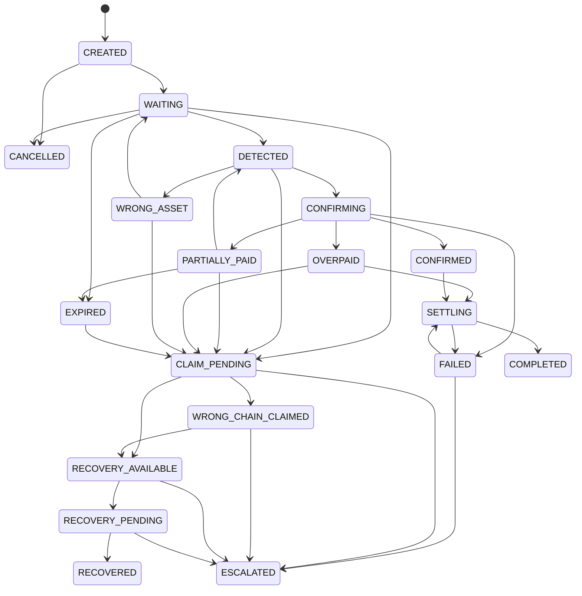
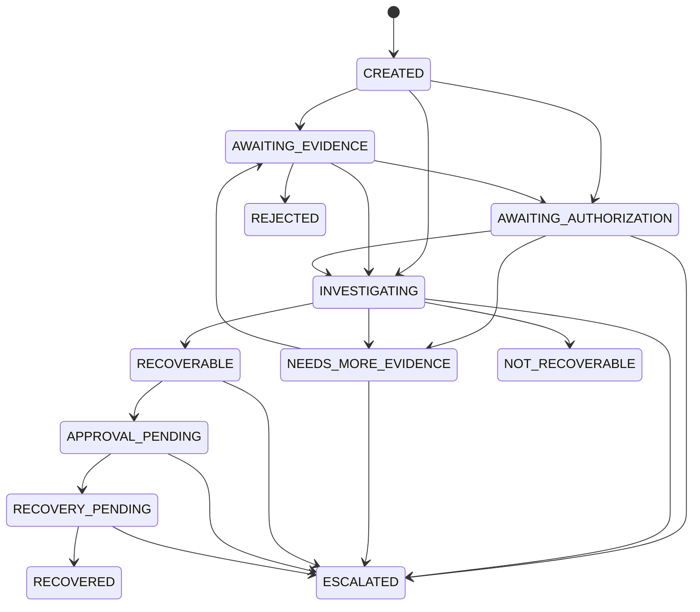

# State Machines

## Payment state machine

The legal transitions are encoded in `backend/crates/domain/src/payment.rs`; application code must call
that domain rule instead of assigning arbitrary state strings.



`CANCELLED` is added because the API requires `POST /v1/payments/:id/cancel`; the original list
was explicitly presented as possible states rather than an exhaustive enum.

A wrong-asset observation does not satisfy the purchase. The payment may return to `WAITING` for
its expected asset while preserving the wrong-asset deposit as immutable evidence, or enter a claim.

## Claim state machine



`RECOVERABLE` is a technical/policy result, not permission to move funds. `APPROVAL_PENDING` must
occur before `RECOVERY_PENDING` in hackathon mode.

## Deposit status

Deposit finality is modeled separately from payment state:

```text
DETECTED -> CONFIRMING -> FINAL
                    \-> ORPHANED (reorg)
```

This avoids using a single aggregate payment state to represent confirmation state of multiple
partial deposits.
